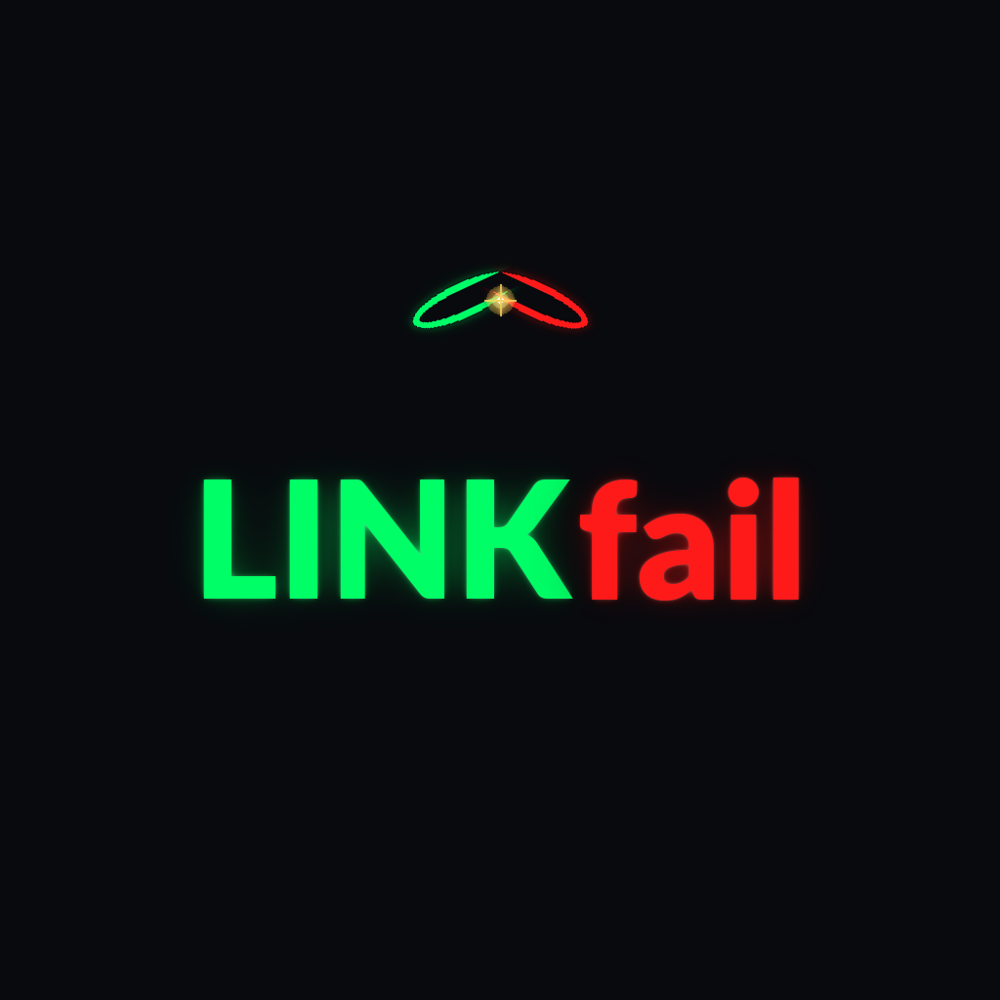

# Linkfail

<p align="center">
  
</p>

<p align="center"><strong>Broken docs links should fail CI — not surprise your users.</strong></p>

[](https://github.com/zer01dollars/linkfail)

Made By Zer01  
Artificially Intelligent, Digitally Enhanced.

---

## What you get

| Feature | What happens |
|---------|----------------|
| **CI gate** | Scan Markdown → **fail the job** if any link is broken |
| **PR comment** | Upsert a report comment (`<!-- linkfail-report -->`) on pull requests |
| **HTML report** | Artifact-ready `linkfail-out/report.html` dashboard |
| **SARIF** | `linkfail-out/linkfail.sarif` for GitHub Code Scanning UI |
| **Weekly Issue** | Open or update a digest Issue on schedule / `workflow_dispatch` |
| **Webhook** | Slack-compatible POST when you set `webhook-url` |

Under the hood: HTTP `HEAD` (falls back to `GET`), timeouts, parallel checks.

**Not included:** full-site crawling, JS-rendered SPA spidering, Cursor rules.

---

## 60-second setup

**1. Buy a license** and add the key as a repo secret named `LINKFAIL_LICENSE_KEY`.

| | Price | |
|--|------:|--|
| Try one run | [$9](https://buy.polar.sh/polar_cl_BaJHHZ30SJeeOOtfQkxWy8WAu1Lft5j2cVwG20suSWa) | |
| Monthly | [$12/mo](https://buy.polar.sh/polar_cl_nQHuiCYT1VVOCk4PWhU6KVUpcBkyEyb9Ssaay0YqiS9) | |
| Lifetime | [$79](https://buy.polar.sh/polar_cl_WPvBpcyTzu1KrtUwh8IlcTjvNd0RZxEFkO48D1N6Eoy) | |

**2. Add one workflow** — CLI or copy:

```bash
npx --yes github:zer01dollars/linkfail linkfail init
# or: ./scripts/install.sh
# or copy examples/linkfail.yml → .github/workflows/linkfail.yml
```

```yaml
name: Linkfail
on:
  pull_request:
  schedule:
    - cron: '0 9 * * 1'   # weekly digest
  workflow_dispatch:

jobs:
  links:
    runs-on: ubuntu-latest
    permissions:
      contents: read
      issues: write
      pull-requests: write
    steps:
      - uses: actions/checkout@v4
      - uses: zer01dollars/linkfail@v1
        with:
          polar-license-key: ${{ secrets.LINKFAIL_LICENSE_KEY }}
      - uses: actions/upload-artifact@v4
        if: always()
        with:
          name: linkfail-out
          path: linkfail-out/
```

**3. Push.** On PRs: fail + comment. On Monday cron: Issue digest. Reports land in `linkfail-out/`.

No `linkfail.yml` required. Built-in defaults scan `**/*.md` and ignore localhost + common badge hosts.

---

## Pricing

Same Polar checkout links as above. Key prefixes:

- `LINKFAIL-1X…` — single use (usage incremented on validate)
- `LINKFAIL…` — monthly
- `LINKFAIL-LT…` — lifetime

---

## CLI

```bash
# from a clone
npm install
npx linkfail init /path/to/your-repo
npx linkfail check          # SKIP_LICENSE by default; writes linkfail-out/
npx linkfail check --license "$LINKFAIL_LICENSE_KEY"
```

`./scripts/install.sh [dir]` wraps `linkfail init`.

---

## Optional config

Create `linkfail.yml` at the repo root (see [`templates/linkfail.example.yml`](templates/linkfail.example.yml)):

```yaml
include:
  - "**/*.md"
exclude:
  - "**/CHANGELOG.md"
ignoreUrls:
  - "https://twitter.com/"
timeoutMs: 10000
concurrency: 8
checkHtml: false
```

---

## Action inputs

| Input | Default | Meaning |
|-------|---------|---------|
| `polar-license-key` | — | Your Polar key |
| `polar-organization-id` | Zer01 org | Override Polar org id |
| `mode` | `auto` | fail on PR/push, Issue on schedule |
| `fail-on-broken` / `open-issue` | *(auto)* | Overrides for `mode` |
| `comment-on-pr` | `true` on `pull_request` | Upsert PR report comment |
| `write-sarif` | `true` | Write `linkfail-out/linkfail.sarif` |
| `webhook-url` | — | Slack incoming webhook (or `LINKFAIL_WEBHOOK_URL`) |
| `output-dir` | `linkfail-out` | Report directory |
| `config-path` | `linkfail.yml` | Optional config |
| `skip-license` | `false` | Try without a key (dev) |
| `github-token` | `GITHUB_TOKEN` | Issues + PR comments |
| `issue-title` | `Linkfail: broken links detected` | Digest title |

Outputs: `broken-count`, `ok-count`, `url-count`, `issue-url`, `comment-url`, `report-dir`.

---

## Badge

```markdown
[](https://github.com/zer01dollars/linkfail)
```

---

## Docs site (GitHub Pages)

This repo ships a one-page marketing site at [`docs/site/`](docs/site/). To publish: **Settings → Pages → Deploy from a branch**, folder `/docs` (or serve `docs/site` via Actions). No custom domain required.

Preview locally: open `docs/site/index.html` in a browser.

---

## Try locally (no Polar key)

```bash
git clone https://github.com/zer01dollars/linkfail
cd linkfail
npm install
npm test
npm run local    # fixtures → expect broken links + linkfail-out/
```

---

## License

Apache-2.0. Product license keys via [Polar](https://polar.sh) (org `driftwatch-kit`).

Made By Zer01 — Artificially Intelligent, Digitally Enhanced.
